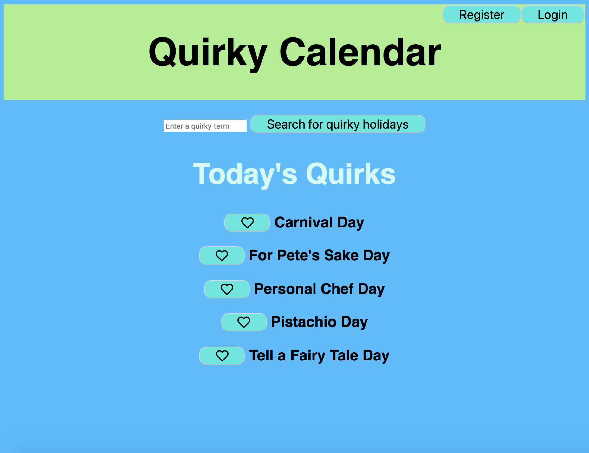
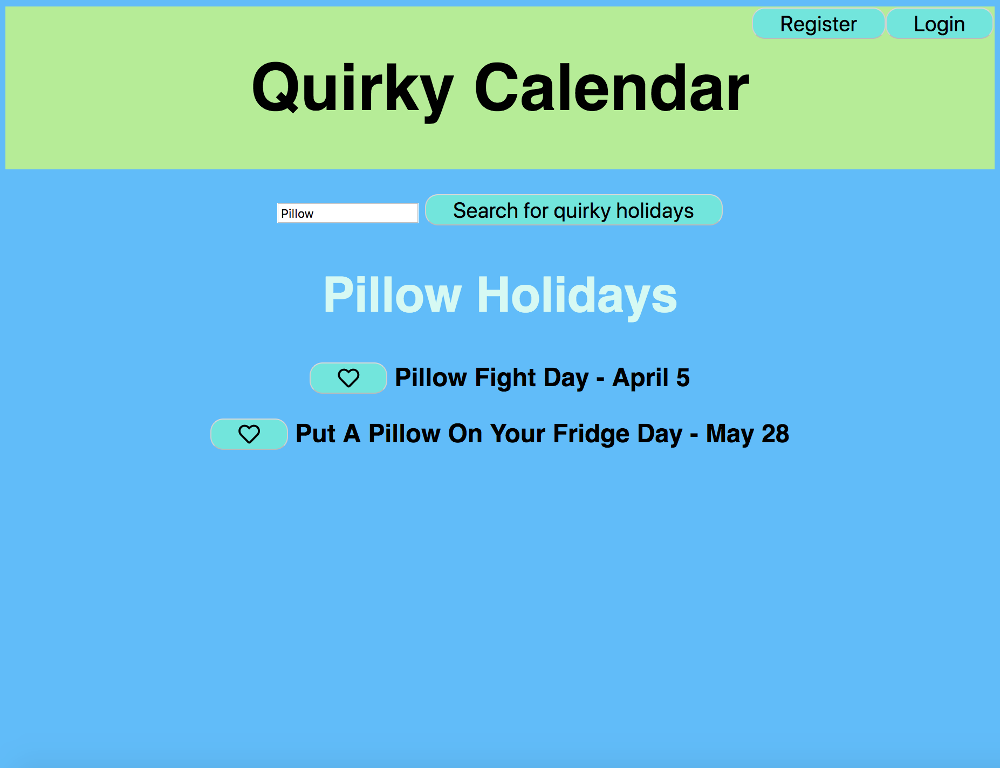
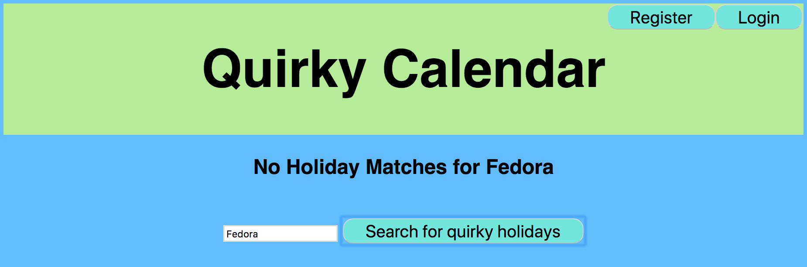
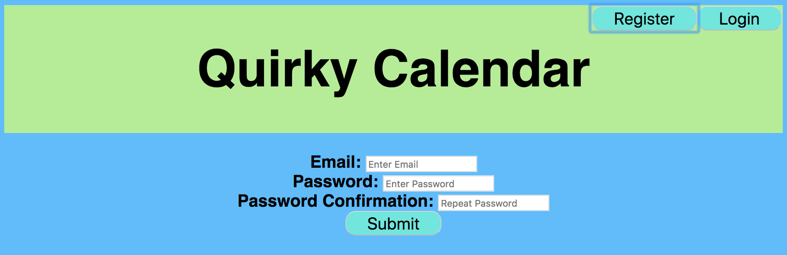
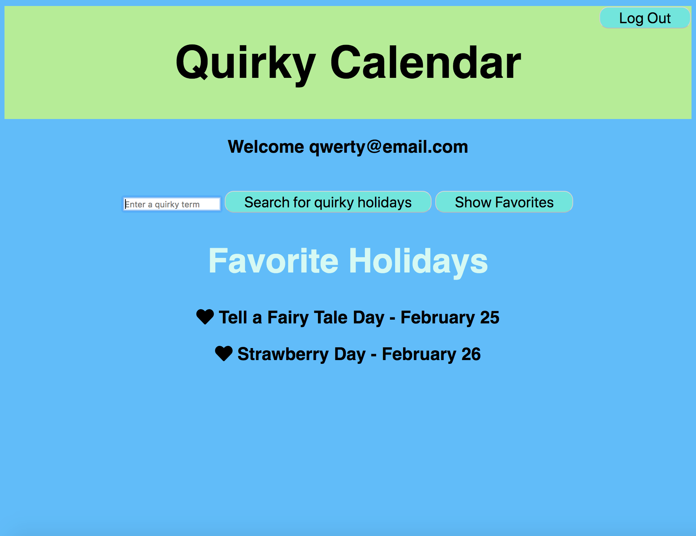

# Quirky Calendar

## Introduction
Quirky Calendar shows fun holidays year round.  Visitors can search for holidays by name. Visitors can also register and login as users on our site.  Once logged in, a user can favorite holidays.  Users can see the dates of their favorited holidays.

## Initial Setup

These instructions will get you a copy of the project up and running on your local machine for development and testing purposes.

From GitHub clone down repository using the following commands in terminal:
* `git clone git@github.com:jplao/quirky_calendar_fe.git`
* `cd quirky_calendar_fe`

## How to Use

### Running the Server Locally

To run the server locally run:
* `npm start`

In your browser visit:
* `http://localhost:8080/` to run your application.

### Home Page

When visitors first visit the page they will see buttons to register, login, a search field to find holidays with a given name, and today's fun holidays

### Showing Results for a Searched Location

When a visitor enters a term into the search field and clicks on "Search for Quirky Holidays" they will see a list of holidays that have that query in it's name as well as the date for those holidays.

If there are no holidays with that query, a message will be displayed letting the user know there are no holidays for with names that include that term.

### Registering a New User

To create a new account, a visitor can click on the "Register" button located at the top right side of the window. A form will be displayed with fields for email, password, and password confirmation.

### Logging in

To log in to an account that has already been created, a visitor can click on the "login" button.  A form will be displayed with fields for email and password.  

### Favorited Holidays

Once logged in, a user can display their favorited holidays by clicking on "Show Favorites". A list of holidays that the user has favorited and their dates will be displayed.

### Logging Out

Once a user logs out, a message will be displayed to confirm they have logged out.  The "log out" button will be replaced by the "register" and "login" buttons.

## Known Issues

* Searched terms must be entered with the first letter capitalized
* No error messages are displayed when a visitor tries to favorite a holiday without logging in.
* No error messages are displayed with invalid login or registration attempts

## Core Contributors

* Jennifer Lao - Github: [jplao](https://www.github.com/jplao)

## Built With

* [JavaScript](https://www.javascript.com/)
* [jQuery](https://jquery.com/)
* [Express](https://expressjs.com/)
* [Mocha](https://mochajs.org/)
* [Chai](https://chaijs.com/)

## GitHub Pages

To view this project in production visit <https://jplao.github.io/quirky_calendar_fe/>.

## Initial Images

